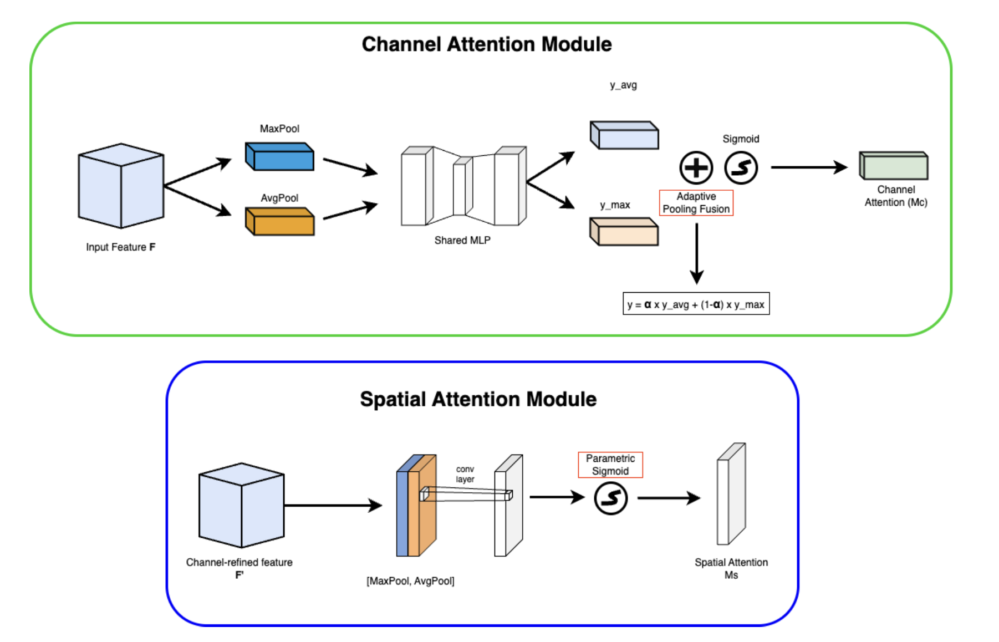

# Parametric Channel Attention Module (PCAM)

  

This repository contains the implementation of **PCAM (Parametric Channel Attention Module)**, a lightweight enhancement to convolutional attention for image classification. PCAM extends CBAM (Woo.et.al, 2017) by replacing fixed design assumptions with **learnable mechanisms** that improve gradient flow and attention focus.

The final architecture integrates:
- **parametric sigmoid gating** (learnable temperature)  
- **learned fusion weight** between average and max pooling  

PCAM is evaluated on **CIFAR-10** and **STL-10** using ResNet-18.

---

## Motivation

Existing attention modules such as **SE** and **CBAM** rely on:
- fixed pooling assumptions (avg + max with equal weights),
- static sigmoid gating that often saturates and causes vanishing gradients.

Our paper identifies two key limitations:
1. **Static sigmoid gates** saturate early and restrict gradient flow.  
2. **Equal pooling fusion** may not reflect dataset-specific importance between global context (avg) and salient peaks (max).

PCAM addresses both limitations with **learnable, data-driven** mechanisms.

---
## PCAM Architecture

PCAM introduces two modifications to CBAM:

### 1. Learnable Pooling Fusion (Channel Attention)
Instead of summing GAP and GMP equally, PCAM learns a scalar **α ∈ [0,1]**:

`F = α · AvgPool(F) + (1 − α) · MaxPool(F)`

This allows the model to dynamically choose between smooth global statistics and high-activation peaks.

### 2. Parametric Sigmoid Gating
PCAM replaces the fixed sigmoid with a *learnable-temperature* sigmoid:

`σ_T(x) = 1 / (1 + exp(−T · x))`

- High T → softer gate → better gradients in early training  
- Low T → sharper gate → more discriminative focus  

This improves trainability and final attention sharpness.

### 3. Spatial Attention (Optional)
We also test parametric sigmoid in spatial attention, which improves localisation on CIFAR-10 and STL-10.

---

## Experiments

### Datasets
- **CIFAR-10:** 50k train / 10k test  
- **STL-10:** 100k unlabeled + 13k labeled

### Compared Models
- ResNet-18 (baseline)  
- ResNet-18 + CBAM  
- **ResNet-18 + PCAM (ours)**  

All experiments follow the same training settings (lr=0.0001, 10 epochs).

---

## Key Results

### CIFAR-10

| Model             | Top-1 Error ↓ | Top-5 Error ↓ | Avg Precision ↑ |
|------------------|---------------|----------------|------------------|
| ResNet-18        | 5.61%         | 0.15%          | 0.9845           |
| CBAM             | 5.94%         | 0.13%          | 0.9845           |
| **PCAM (ours)**  | **5.49%**     | **0.11%**      | **0.9856**       |

### STL-10

| Model             | Top-1 Error ↓ | Top-5 Error ↓ | Avg Precision ↑ |
|------------------|----------------|----------------|------------------|
| ResNet-18        | 4.837%         | 0.17%          | 0.9890           |
| CBAM             | 4.987%         | 0.175%         | 0.9880           |
| **PCAM (ours)**  | **4.537%**     | **0.125%**     | **0.9890**       |

**PCAM consistently outperforms both CBAM and the baseline.**

---

## Gradient Flow Analysis

PCAM improves optimisation stability:

| Model            | Gradient Norm Variance ↓ |
|-----------------|---------------------------|
| ResNet-18       | 23.18                     |
| CBAM            | 16.77                     |
| **PCAM (ours)** | **15.97**                 |

Lower variance → more stable training → smoother convergence.

---

